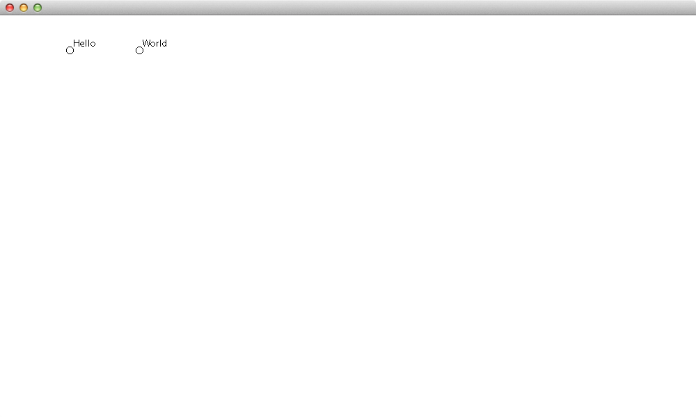
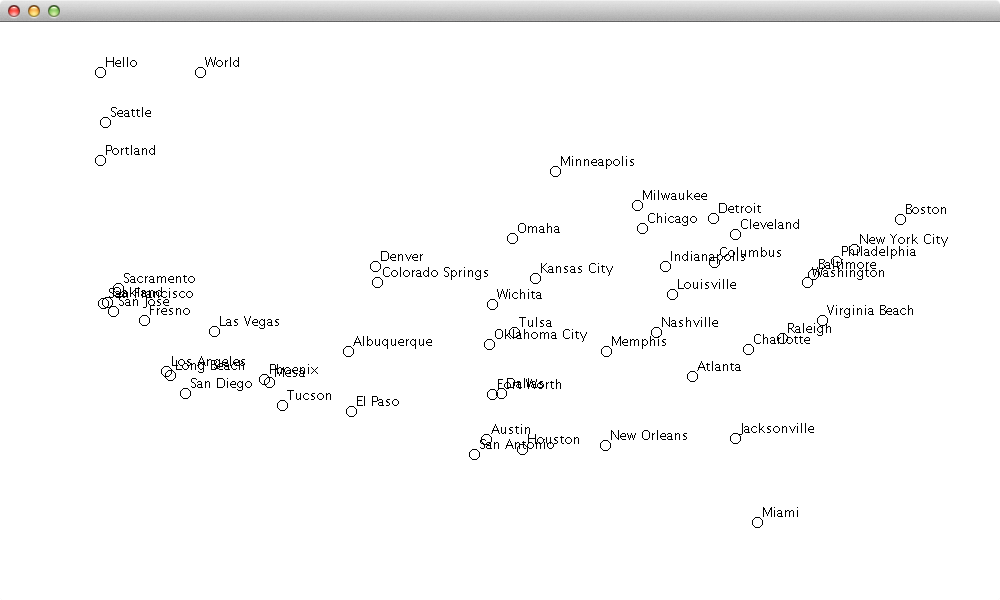
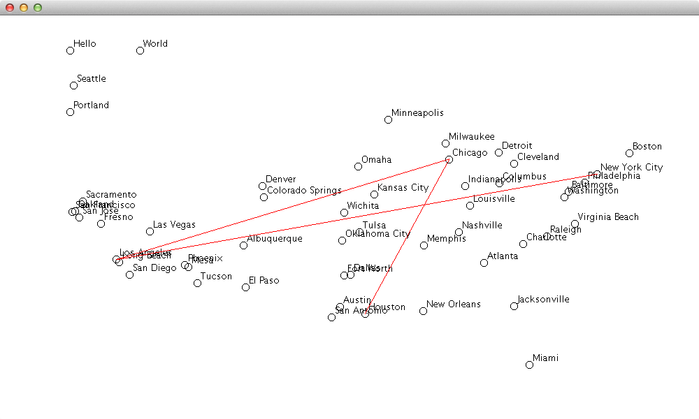
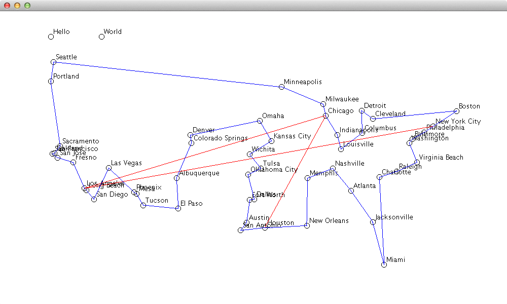

COMP 150, Exam 5 
==================

- Covers Ch 1,2,3,5,6,7,8,9,10
- Thurs Apr 28, 2016
- Due 3pm Apr 28, 2016

Instructions:
-----------------

- This file is meant to be viewed in a text editor like Notepad++, Wordpad, or Sublime Text.
	- NOT Notepad: It doesn't show newlines right.

- The exam is 100 points spread across 2 problems.
- You have the rest of class today to complete these 2 problems.
- Each program requires writing a java program.
- Use comments to explain what you're doing -- the goal is to demonstrate to me that you understand the material.
- You should submit to Blackboard a zip file named "Exam5.zip" with this text file, your .java files, and any other files needed to execute your program (like data files).
- Include all the code needed to make your code run. So if you use functions from a utility class, be sure to include it.

- HINT: If you get stuck on a problem, move on and revisit it later.

- Your exam must be the result of your own effort -- do not communicate with your classmates in any way.
- Obviously, do not look at anyone else's screen or copy their code. 

- You may refer to your textbook, the lecture slides, your notes, and -- with some restrictions -- the Internet.
- You may not post questions online.
- If you use code from the Internet, you must:
	- cite it by including the URL as a comment
	- understand the code itself, commenting each line with your own words

Hardware Store Inventory. (50 points)
---------------------------------------

The file `HardwareStore.java` is provided. You'll edit this file in places marked "Your code here".

The hardware store sells two types of items: regular items and hazardous items. Those classes are defined at the bottom of the file, with some parts filled in already for you. 

At the top of the 'main' method is an example for how the `Item` class is meant to operate. Use this to test your `Item` class. You should write `Item` so that it matches the indicated output below each line. 

Below that, we initialize the store by creating several `Item` and `HazardousItem` objects. Then we sell a bunch of items at random. You should not edit this code.

After selling a bunch of stuff, there are some questions we'd like to ask:

- Part A (20 points): what am I out of?
- Part B (15 points): how much profit did I make?
- Part C (15 points): how many hazardous items do I have in stock?

Your job is to answer these questions by filling in the code labeled "Your code here." Print your answers to the console (do not hard-code your answers in the `.java` file.)

You may modify other parts of the code, but you shouldn't need to do that to solve the problem.

The point of this problem is to show that when your classes have sensible APIs, you can answer lots of interesting questions with very little code. So: if your `Item` class works, then your answers to part A,B,C should only be a few lines each.

Note: In Part C, you should take into account not just the type of item, but also the quantity in stock. So if you have 8 propane tanks and 2 white gas canisters in stock, that counts as 10 hazardous items in stock, not 2.

Note: Keep your code "DRY". (Don't repeat yourself.)

Note: Use the "enhanced for loop" syntax as much as possible. 

Note: Suppose you have an `Item` object named `my_item` and you want to check whether it is also a `HazardousItem` object. Recall from Lecture 7b that you can use the `instanceof` operator like this:

    if( my_item instanceof `HazardousItem` ) { 
    	// my_item is of type HazardoutItem...
    }

Submit `HardwareStore.java`.

City Map (50 points)
----------------------

In this problem, we will draw a map of 50 cities in the United States.

The file `CityMap.java` is provided. You'll edit this file and submit it.

The `main` function and the `DrawPanel` class are both given to you -- you should not have to edit them. However, when you are working on Part A, you may find it useful to comment out parts of `main` that require your solution to Part B and C. 

### Part A (15 points)

Write an interface called `Drawable`, that declares the presence of the following method:

    void draw( Graphics g );

Write a class `LabeledPoint`, which you can use to draw labeled points:

    LabeledPoint implements `Drawable`:
    + String label
    + int x,y
    + void draw( Graphics g )

The `draw` method draws a small circle and also draws the text given by the String `label`, both at the coordinates `(x,y)`. Use the function `g.drawString` to draw text. For example,

    g.drawString( "hello world", 100, 200 );

draws the string "hello world" at coordinates (100,200).

Minor point: Recall that `drawOval(x,y,r,r)` draws a circle whose upper-left corner is at `(x,y)`. Make sure than when the user of `LabeledPoint` draws a labeled point at `(x,y)`, the CENTER of the circle is at `(x,y)`. In other words, your `LabeledPoint` class should draw its points as advertised, even though drawOval doesn't draw it quite in the right place. This is not a big deal, and if you skip it, your map will only look a little off.

Minor point: If the label and the circle overlap a little, feel free to tweak the label's coordinates a bit.

In the given 'main' method, under "Part A", we declare two `LabeledPoint` objects and draw them.

If the `LabeledPoint` class is working properly, the "Part A" code in main should draw a picture like "CityMap-Part-A.png":

### Part B (15 points)

In this part, we'll add code that draws the cities on the map.

Write a class `City`:

    City extends LabeledPoint
    + long population
    + public static ArrayList<City> load( String f )

A `City` is a type of `LabeledPoint`. The city's name is the label, and its latitude and longitude are the x,y coordinates. Additionally, a `City` has a `population`. Because `City` inherits from `LabeledPoint`, you do not need to define a `draw()` method for `City`. You get it for free, from `LabeledPoint`. That's nice!

The `City` constructor should call the superclass's constructor, to prevent repeating code.

In the `City` class, write a static method `load`: 

	static public ArrayList<City> load( String f )

- input: the name of a file that contains city data
- output: an `ArrayList` of `City` objects, one for each city in the indicated file.

This way, one can easily load the cities into a list like this:

	List<City> cities = City.load( "cities_xy_nospaces.tsv" );

The attached file "cities_xy_nospaces.tsv" contains the name, coordinates, and population of the 50 biggest cities in the US. The coordinates are not latitude / longitude; they are pixel coordinates for placement on a 1000-by-600 JFrame. But they are roughly spatially correct: New York is in upper-right, Los Angeles is in lower-left. 

Note: For ease of scanning, "cities_xy_nospaces.tsv" has underscores in city names: "New_York", etc. This makes it easier for you; otherwise `Scanner.next()` would choke on the spaces. However, when copying that name into your `City` object, you should replace the underscores with spaces. The `String` class has a `replace` method that you can look up.

In the given `main` method, under "part B", you are given code that loads the data from "cities_xy_nospaces.tsv" into a list of cities and plots them. 

If the City class is working properly, the "Part B" code in main should draw a picture like "CityMap-Part-B.png":

### Part C (20 points)

Define a class `Itinerary`, which holds a list of `Cities` that we intend to visit on a vacation.

    Itinerary implements Drawable
    + void add( City c )
    + double totalDistance()
    + void draw( Graphics g )
    + void setColor( Color c )

The client adds cities to the `Itinerary` in the order that he/she will visit them. For example:

    City ny = new City( "New York",    500, 200, 99999);
    City la = new City( "Los Angeles", 100, 300, 12345);
    City sj = new City( "San Jose",    150, 150, 98765);
    City po = new City( "Portland",    150,  50, 13579);

    Itinerary it = new Itinerary();
    it.add( ny );
    it.add( la );
    it.add( sj );
    it.add( po );

An `Itinerary` object can calculate the distance traveled like this:

    System.out.println(
       "Total distance traveled: " + it.totalDistance() + " pixels."
    );

"Total distance traveled: 670.4 pixels."

That's the distance from NY to LA, plus the distance from LA to SJ, plus the distance from SJ to Portland.

The assumption is that the traveler starts at the first city and stops at the last city.

Note that this distance is not geographically correct, since the city coords have been scaled to be in pixel values. But it is a good first step.

The `draw` method draws lines between the cities, showing the path from start to end. It does not draw the cities themselves.

The lines are red by default, but you can change them with the `setColor` method.

In the given `main` method, under "Part C", you are given code that makes an `Itinerary` object, adds 4 cities to it, and draws it.

If the `Itinerary` class is working properly, the "Part C" code in main should draw a picture like "CityMap-Part-C.png":

With the code you've developed, you can do amazing things. If you have time, check out the "Bonus" code in main, which draws the shortest path that visits every city and returns to its starting point. The problem of finding the right order of the cities that minimizes the distance traveled is a very interesting problem called the Traveling Salesman problem, and is typically explored in a class on algorithms like COMP 151.

In the given `main` method, Part "Bonus", you are given code that makes an `Itinerary` object, adds the cities in the order that comprises the shortest tour, and draws it.

If your `Itinerary` class is working properly, the "Part Bonus" code in main should draw a picture like "CityMap-Part-Bonus.png":

