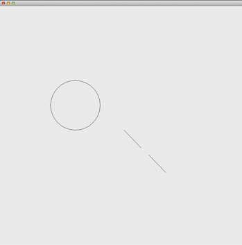
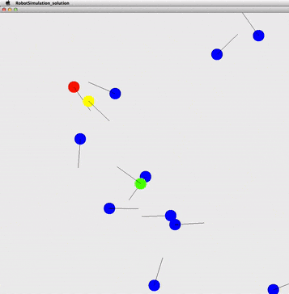

COMP 150, Lab 10c
====================

Due noon on Tues Apr 26, 2016.

Sorting cities. (60 points)
------------------------------

The file `SortCities.java` is attached.

### Part A (20 points)

Make a `City` class with relevant fields (name, population, etc). Read the `CITY_NAMES` and `CITY_DATA` arrays into a list of `City` objects. 

`City` should implement `toString`, so that you can `println` it nicely.

### Part B (20 points)

Have `City` implement `Comparable<City>` so that sorting the list sorts the cities according to their "yearly salary after subtracting 12 months of rent".

### Part C (20 points)

Write static `Comparators` for `City` named `SalarySort` and `PostRentSalarySort` to make it easy to sort the list based on different criteria: the raw salary, and the salary after subtracting 12 months of rent.

(See Lec 10c for an example of this.)

The code in `SortCities.java` should guide your code's development.

## Robot simulation. (120 points)

The file `RobotSimulation.java` is provided.

This file runs an animation for a few seconds, as shown in the attached video `robot-sim-start.mov`. A circle and some lines move around:

In this problem you will write code to reproduce the attached robot simulation video `robot-simulation.mov`:

Write classes to embody 3 types of robots:

- `Circlebot`   just drives in a circle.
- `Chasebot`    drives toward a robot. 
- `Fleebot`     drives away from a robot.

In the video, the red robot is a `Chasebot` that chases the green `Circlebot`. The yellow `Fleebot` runs away from the `Chasebot`.

Learning OOP involves iterating your designs, so this problem is intentionally open-ended. Your grade depends on how easily I can read your code, and how well you leverage the concepts of inheritance, abstract classes, and interfaces for the purposes of writing clean, functional code (including "staying DRY").

